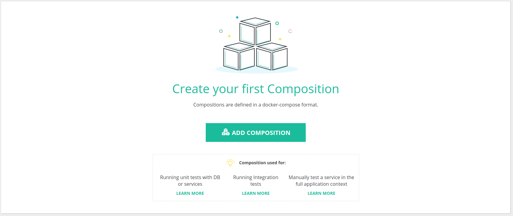
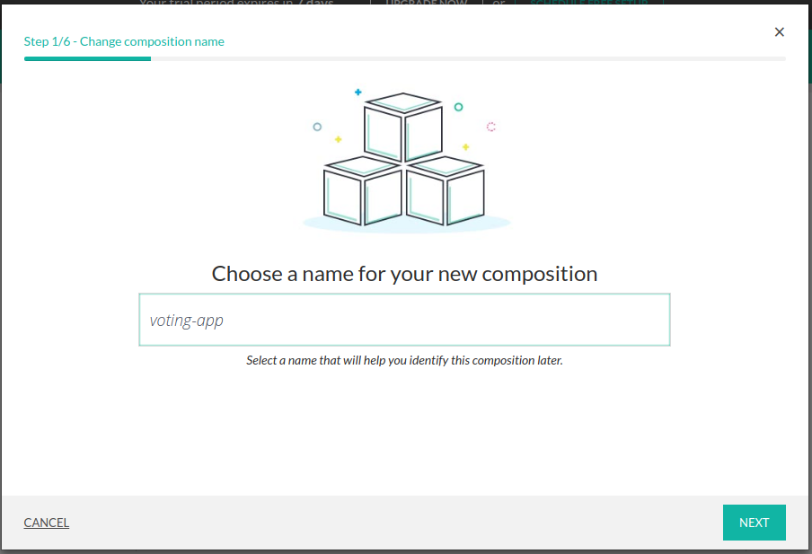
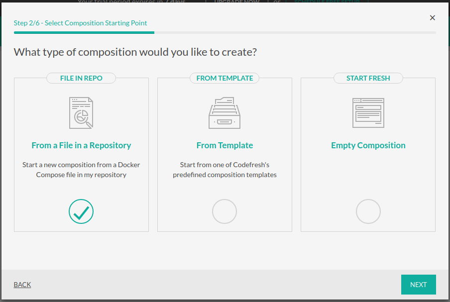
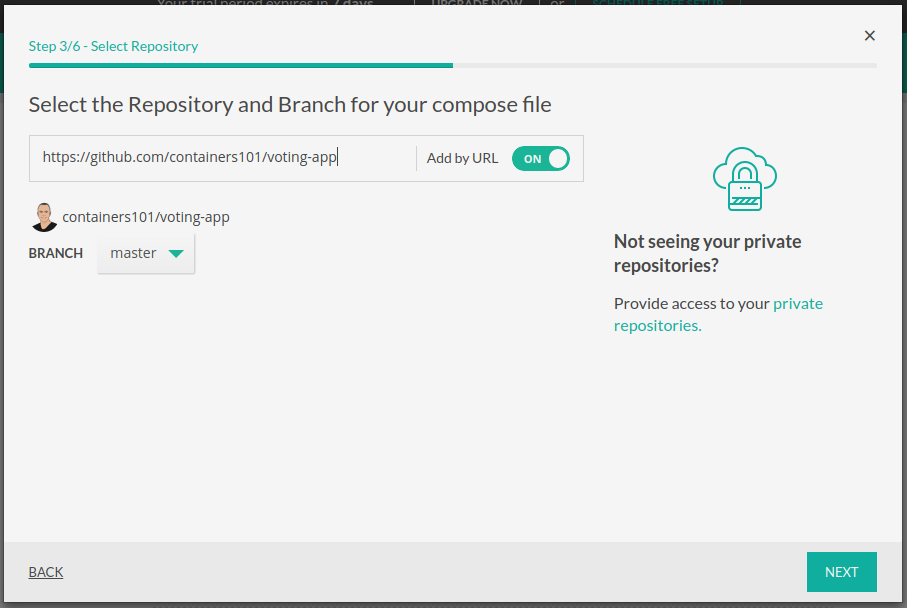
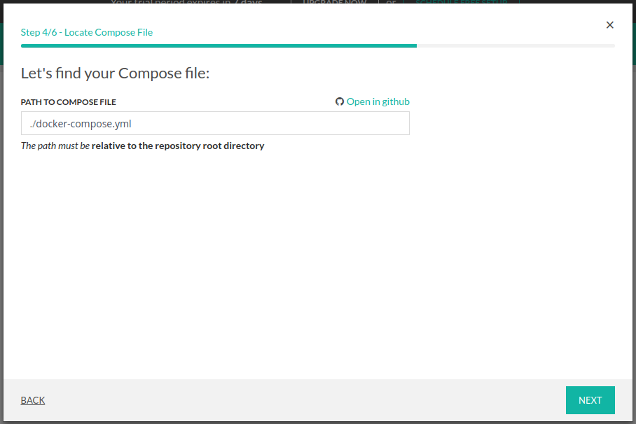
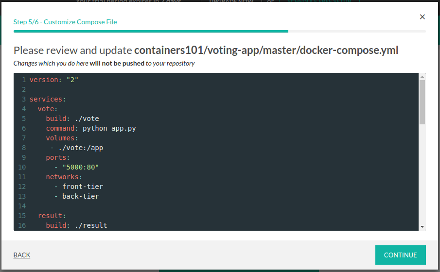
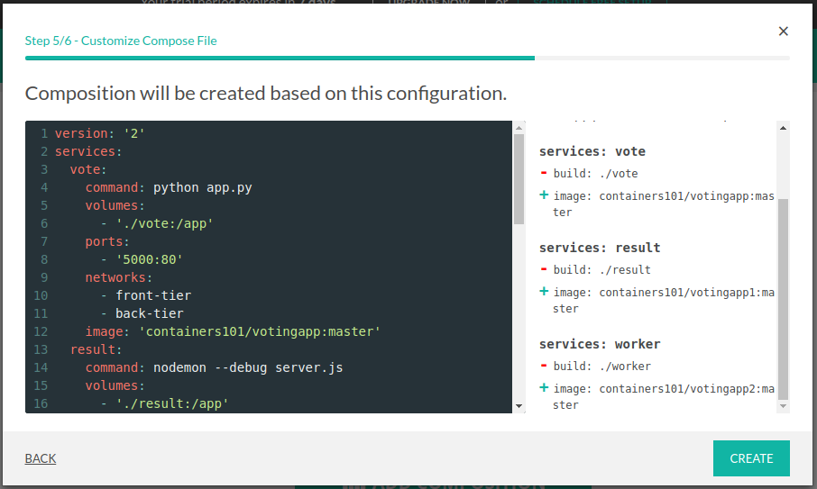
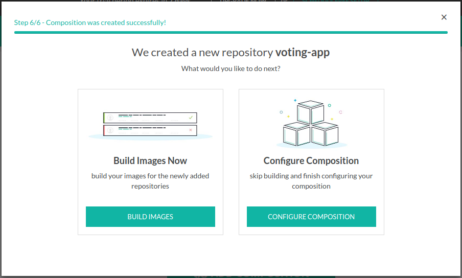
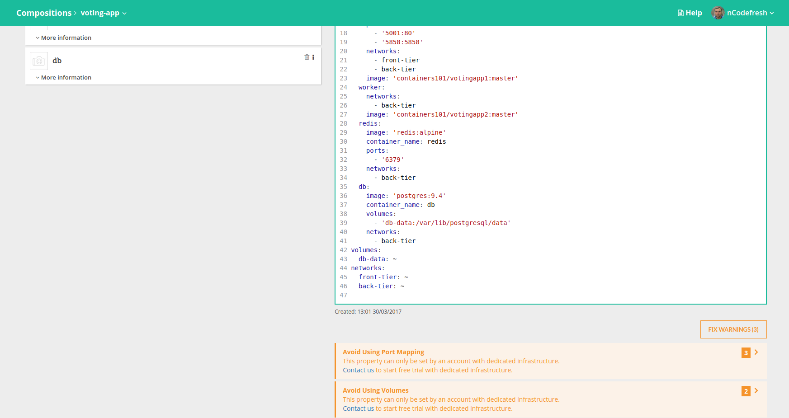

Voting App -> Behalf Demo
==========

-------------

this application is based on Docker's example [voting app](https://github.com/docker/example-voting-app). 

--------------------

Architecture
------------

* A Python webapp which lets you vote between two options
* A Redis queue which collects new votes
* A .NET worker which consumes votes and stores them in…
* A Postgres database backed by a Docker volume
* A Node.js webapp which shows the results of the voting in real time

####*Add repository using composition wizard:*

1. Go to The Compositions tab

2. Click on the button ADD COMPOSITION.

3. Enter the name of composition and click NEXT

4. Add your docker-compose.yml from file and click NEXT

5. Specify the link to the repository, choose the branch 'start_from_compose' and click NEXT

6. Specify the path to docker-compose.yml and click NEXT

7. Review your docker-compose.yml and click CONTINUE

8. See the composition that will be created based on your file. It will parser your file and create a pipeline
in case we detected warnings you can fix them later in the compositoin view

9. Then you can choose BUILD IMAGES or go to COMPOSITION CONFIGURATION
10. In composition view you will see it and will be able to fix the warnings/errors
